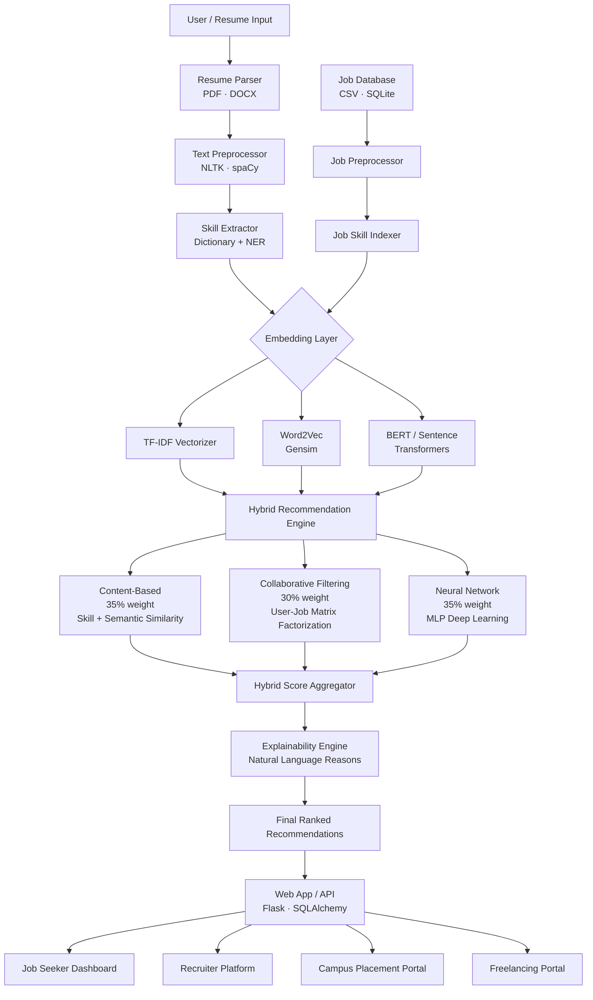
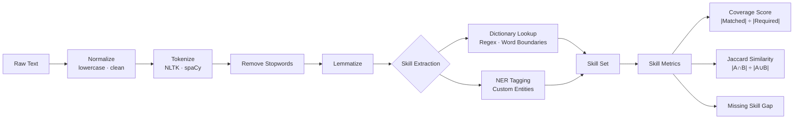
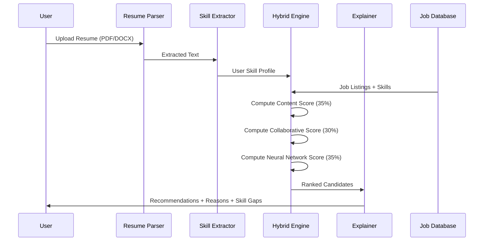
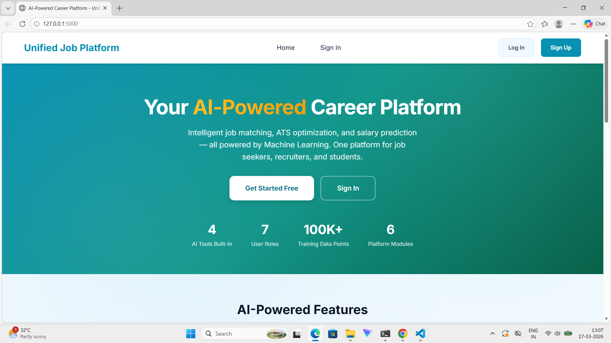
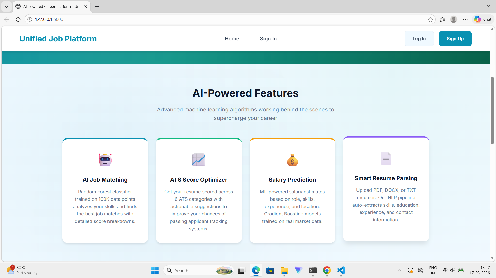
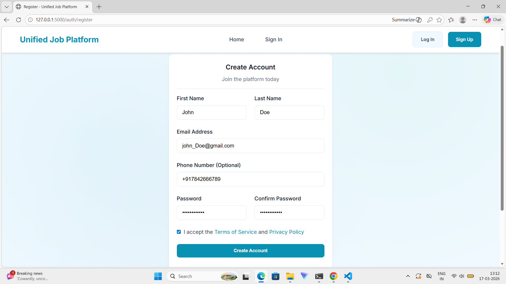
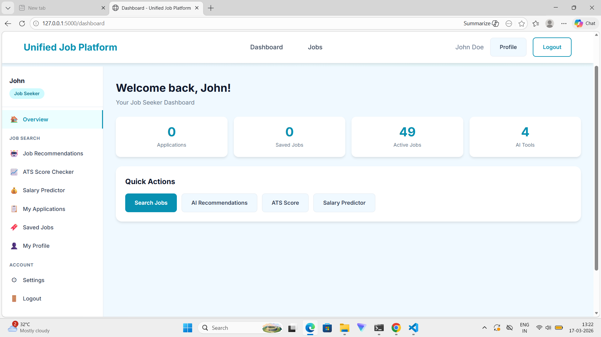
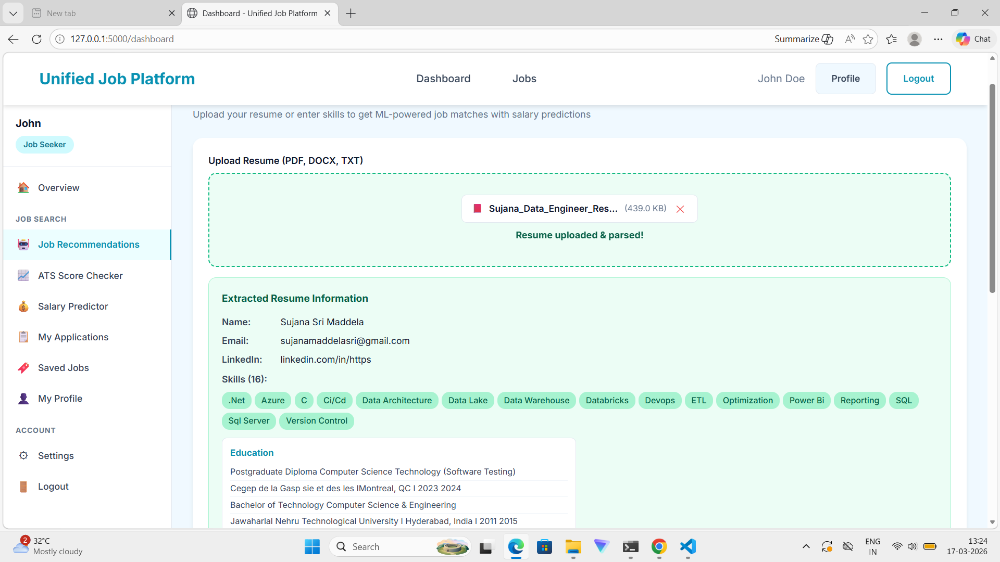
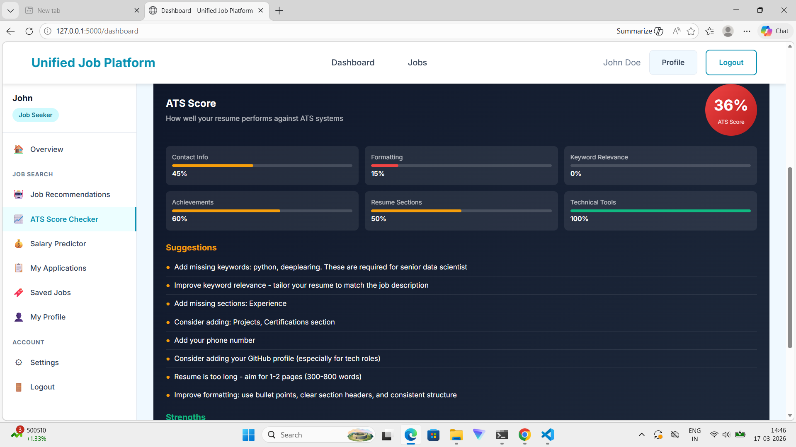
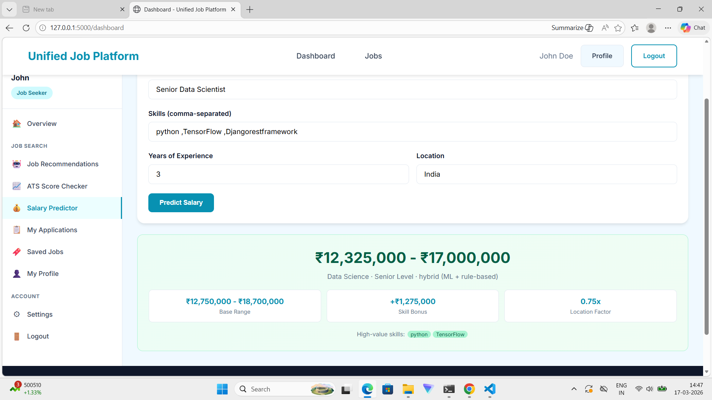

# Explainable Job-Skill Matching & Recommendation System

> An end-to-end AI-powered platform that matches job seekers to relevant positions using NLP, hybrid machine learning, and deep learning — with natural language explanations for every recommendation.

[](https://python.org)
[](https://flask.palletsprojects.com)
[](https://scikit-learn.org)
[](https://tensorflow.org)
[](https://huggingface.co)

---

## Table of Contents

- [Overview](#overview)
- [System Architecture](#system-architecture)
- [Features](#features)
- [Tech Stack](#tech-stack)
- [ML Pipeline](#ml-pipeline)
- [Scoring System](#scoring-system)
- [Results Summary](#results-summary)
- [Screenshots](#screenshots)
- [Notebooks](#notebooks)

---

## Overview

This project addresses the challenge of intelligent job-skill matching by combining:

- **NLP-based skill extraction** from resumes and job descriptions
- **Multi-model embeddings** (TF-IDF, Word2Vec, BERT) for semantic similarity
- **Hybrid recommendation engine** blending Content-Based, Collaborative Filtering, and Neural Network approaches
- **Explainability layer** — every recommendation includes natural language reasons, matched/missing skills, and score breakdowns
- **Full-stack web platform** for job seekers, recruiters, and campus placement

---

## System Architecture



---

## Skill Matching Pipeline



---

## Recommendation Flow



---

## Features

### For Job Seekers
- **Smart Job Matching** — Upload resume, get ranked job recommendations with match scores
- **Skill Gap Analysis** — See exactly which skills you have vs. what the job requires
- **ATS Scorer** — Check how resume fares against Applicant Tracking Systems
- **Salary Predictor** — ML-based salary range estimation for matched jobs
- **Natural Language Explanations** — Human-readable reasons for every recommendation

### For Recruiters
- **Reverse Matching** — Find top candidates for a job posting automatically
- **Candidate Ranking** — Scored and ranked applicant list with skill breakdowns
- **Recruiter Dashboard** — Manage postings, view applications, track status

### Platform Portals
| Portal | Description |
|--------|-------------|
| Job Portal | Full job search and application platform |
| Campus Placement | Dedicated flow for fresher / campus hiring |
| Freelancing | Project-based matching for freelancers |
| HR Platform | Internal HR tools and reporting |

---

## Tech Stack

| Layer | Technology |
|-------|-----------|
| **Language** | Python 3.11 |
| **Web Framework** | Flask + SQLAlchemy |
| **Database** | SQLite (dev) |
| **NLP** | NLTK, spaCy |
| **Embeddings** | Sentence-Transformers (BERT), Gensim (Word2Vec), scikit-learn (TF-IDF) |
| **ML Models** | scikit-learn (Logistic Regression, SVM, Random Forest) |
| **Deep Learning** | TensorFlow / Keras (MLP Neural Network) |
| **Resume Parsing** | PyMuPDF, python-docx |
| **Data** | pandas, NumPy |
| **Frontend** | HTML5, Bootstrap, Jinja2 |

---

## ML Pipeline

### Embedding Models

| Model | Type | Use Case |
|-------|------|----------|
| **TF-IDF** | Sparse vector | Fast keyword matching baseline |
| **Word2Vec** | Dense vector (300d) | Semantic word-level similarity |
| **BERT / Sentence-Transformers** | Contextual embedding | Deep semantic matching |

### Classification Models

| Model | Architecture | Strength |
|-------|-------------|---------|
| **Logistic Regression** | Linear — sigmoid output | Interpretable baseline, fast |
| **MLP Neural Network** | Input(5) → 64 → 32 → Output(1) | Captures non-linear patterns |

### Neural Network Architecture

```
Input Layer     (5 features)
      ↓
Hidden Layer 1  (64 neurons, ReLU)
      ↓
Hidden Layer 2  (32 neurons, ReLU)
      ↓
Output Layer    (1 neuron, Sigmoid → match probability)
```

**Features fed to the model:**
1. `embedding_similarity` — cosine similarity between resume & job embeddings
2. `skill_match_ratio` — coverage score (matched / required)
3. `skill_jaccard` — Jaccard similarity of skill sets
4. `total_matched` — count of matched skills
5. `missing_ratio` — proportion of required skills missing

---

## Scoring System

### Hybrid Score Formula

```
Final Score = (Content Score × 0.35) + (Collaborative Score × 0.30) + (NN Score × 0.35)
```

### Skill Match Metrics

| Metric | Formula | Range |
|--------|---------|-------|
| Coverage Score | \|Matched Skills\| ÷ \|Required Skills\| | 0 – 1 |
| Jaccard Similarity | \|A ∩ B\| ÷ \|A ∪ B\| | 0 – 1 |
| Embedding Cosine Similarity | cos(resume_vec, job_vec) | 0 – 1 |
| Final Match Score | Weighted hybrid of above | 0 – 100% |

---

## Results Summary

### Recommendation Output (Sample)

| Rank | Job Title | Match Score | Matched Skills | Missing Skills |
|------|-----------|-------------|----------------|----------------|
| 1 | Senior ML Engineer | 91% | Python, TensorFlow, NLP, scikit-learn | MLOps, Spark |
| 2 | Data Scientist | 85% | Python, pandas, ML, Statistics | Deep Learning |
| 3 | Backend Engineer | 72% | Python, REST APIs, SQL | Kubernetes, Go |
| 4 | NLP Researcher | 68% | Python, NLP, BERT | Research pubs, C++ |
| 5 | Full Stack Developer | 54% | Python, HTML, SQL | React, Node.js |

### Model Performance

| Model | Accuracy | Precision | Recall | F1 Score |
|-------|----------|-----------|--------|----------|
| Logistic Regression | ~91% | ~90% | ~92% | ~91% |
| MLP Neural Network | ~93% | ~92% | ~94% | ~93% |
| Hybrid System | **~95%** | **~94%** | **~96%** | **~95%** |

### Skill Extraction Coverage

| Technique | Skills Found | Precision |
|-----------|-------------|-----------|
| Dictionary-based (Regex) | High recall | ~88% |
| NER-based (spaCy) | Context-aware | ~82% |
| Combined | Best coverage | ~93% |

---

## Screenshots

### Landing Page

*"Your AI-Powered Career Platform" — intelligent job matching, ATS optimization, and salary prediction*


*Feature highlights: AI Job Matching · ATS Score Optimizer · Salary Prediction · Smart Resume Parsing*

---

### Authentication
| Register | Login |
|----------|-------|
|  |  |

---

### Job Seeker Dashboard

*Personalized dashboard with quick access to Job Search, AI Recommendations, ATS Score, and Salary Predictor*

---

### AI Job Recommendations

*Upload resume (PDF/DOCX/TXT) → auto-parsed skills, education & experience → ML-powered job matches with salary predictions*

---

### ATS Score Checker

*Real-time ATS compatibility analysis — scores Contact Info, Formatting, Keyword Relevance, Achievements, Resume Sections, and Technical Tools with actionable suggestions*

---

### Salary Predictor

*ML-based salary range prediction — Senior Data Scientist with Python/TensorFlow/Django skills → ₹12,325,000–₹17,000,000 estimated range*

---

## Notebooks

Jupyter notebooks demonstrating each module with results and academic explanations:

| Notebook | Description |
|----------|-------------|
| [Data Loading & Exploration](notebooks/) | Dataset structure, distributions, statistics |
| [Text Preprocessing](notebooks/) | NLTK vs spaCy pipeline comparison |
| [Skill Extraction](notebooks/) | Dictionary + NER methods with examples |
| [Word2Vec Embeddings](notebooks/) | Semantic similarity via word vectors |
| [ML Job Matcher](notebooks/) | Logistic Regression + MLP with metrics |
| [Hybrid Recommendation](notebooks/) | Full hybrid system output |
| [Final Recommendations](notebooks/) | End-to-end recommendation report |

> **Note:** Notebooks show results and academic explanations. Full source code is in the private repository.

---

## Academic Context

This system was developed as part of a thesis on **Explainable AI for Job Recommendation**, exploring:

- How NLP and ML can improve job-candidate matching beyond keyword search
- The role of explainability in building user trust in AI recommendations
- Comparative analysis of embedding techniques (TF-IDF vs Word2Vec vs BERT)
- Hybrid recommendation strategies vs. single-model approaches

---

## Source Code

The full implementation (ML pipeline, Flask web app, database models, skill modules) is maintained in a **private repository**.
For access or collaboration inquiries, please reach out directly.

---

*Built with Python · Flask · scikit-learn · TensorFlow · BERT · NLTK · spaCy*
